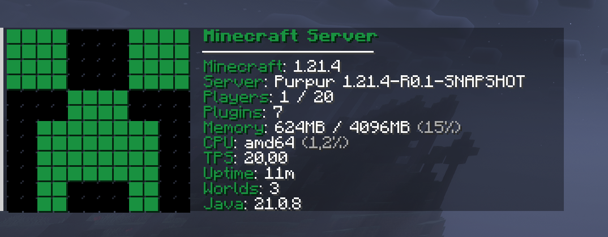

# Minefetch
A Minecraft plugin like FastFetch/NeoFetch that shows information about the server.

Paper 1.21+

You can customize the default ASCII art by adding an ascii.txt file to the plugin directory.
You can also edit the displayed messages in the config.yml file.
You can turn off modules or change their order.
# Build from source
Requires Java 21
1. Clone repo
2. $ mvn package
3. Enjoy
